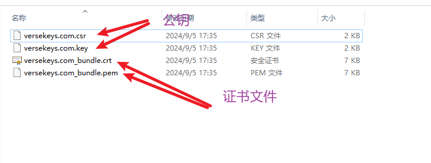

### https不像http一样直接就可以使用，需要进行一些处理

## 核心要点就一个——拿到ssl证书文件（有很多类型，可以互转，但是需要两个文件，一个是公钥，一个是证书文件）

> 公钥，私钥都是一般为 .key .pem

> 证书文件 一般是 .crt .pem

> 这些东西可以云服务器直接买，也可以自己使用openSLL生成，然后去提交验证.



## 拿到这两个文件之后的步骤就不是什么难事了

```
#!/usr/bin/env node

/**
 * Module dependencies.
 */

var app = require('../app');
var debug = require('debug')('gardenapp:server');
var http = require('http');
var https = require('https');
const fs = require('fs');
var path = require('path');

/**
 * Get port from environment and store in Express.
 */
// options参数的数据类型是对象，所以先把文件读出来放在对象里
// 通过fs模块的readFileSync()方法读取内容
// 推荐使用绝对路径，原因在下面
const options = {
  key: fs.readFileSync(path.join(__dirname, '../static/versekeys.com.key')),
  cert: fs.readFileSync(path.join(__dirname, '../static/versekeys.com_bundle.pem'))
};

var portHttps = normalizePort('443');
var portHttp = normalizePort('80');


app.set('portHttp', portHttp);
app.set('portHttps', portHttps);

/**
 * Create HTTP server.
 */

var serverHttps = https.createServer(options,app);
var serverHttp = http.createServer(app);

/**
 * Listen on provided port, on all network interfaces.
 */

serverHttp.listen(portHttp);
serverHttp.on('error', onError);
serverHttp.on('listening', onListening);

serverHttps.listen(portHttps);
serverHttps.on('error', onError);
serverHttps.on('listening', onListening);

/**
 * Normalize a port into a number, string, or false.
 */

function normalizePort(val) {
  var port = parseInt(val, 10);

  if (isNaN(port)) {
    // named pipe
    return val;
  }

  if (port >= 0) {
    // port number
    return port;
  }

  return false;
}

/**
 * Event listener for HTTP server "error" event.
 */

function onError(error) {
  if (error.syscall !== 'listen') {
    throw error;
  }

  var bind = typeof port === 'string'
    ? 'Pipe ' + port
    : 'Port ' + port;

  // handle specific listen errors with friendly messages
  switch (error.code) {
    case 'EACCES':
      console.error(bind + ' requires elevated privileges');
      process.exit(1);
      break;
    case 'EADDRINUSE':
      console.error(bind + ' is already in use');
      process.exit(1);
      break;
    default:
      throw error;
  }
}

/**
 * Event listener for HTTP server "listening" event.
 */

function onListening() {
  var addr = serverHttp.address();
  var bind = typeof addr === 'string'
    ? 'pipe ' + addr
    : 'port ' + addr.port;
  debug('Http server  Listening on ' + bind);
  var addr = serverHttps.address();
  var bind = typeof addr === 'string'
    ? 'pipe ' + addr
    : 'port ' + addr.port;
  debug('Https server Listening on ' + bind);
}

```
