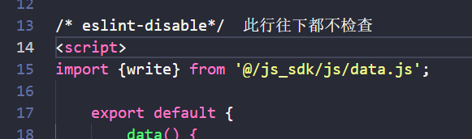
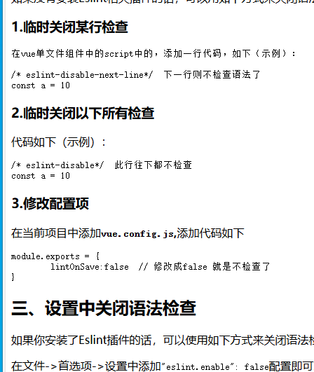

## 插件配置

### api文档

[VS code中python代码格式化配置 - burningJ - 博客园 (cnblogs.com)](https://www.cnblogs.com/burningJ/p/17864937.html)

用户配置打开

快捷键 ctrl+shift+p

上方搜索输入>settings.json

## 让vs code不报错的方法

### api文档

[Vscode关闭Eslint语法检查的多种方式(保证有效) / 张生荣 (zhangshengrong.com)](https://www.zhangshengrong.com/p/JKN8WE9Da6/)

